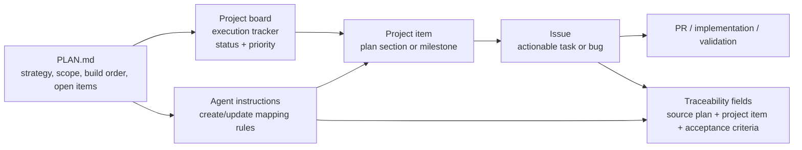

# Github Project board

## Recommended relationship model

This is the cleanest structure for your repo:

- `PLAN.md` is the canonical source of truth for strategy, scope, build order, and open items.
- GitHub Project board is the execution surface: backlog, current work, priorities, and status.
- Issues are granular work units that represent actionable tasks or bugs.
- Agent instructions define the conversion rules: when to turn a plan section into a project item or an issue, and how to keep them linked.

The key rule is:

> `PLAN.md` defines what matters. The project board tracks progress. Issues are the implementation units. Agent instructions enforce the link between them.

---

## What to keep as-is

Your current project fields are already a good fit for plan-driven tracking:

- Status
- Priority
- Owner
- Area
- Source Plan
- Acceptance Criteria
- Risks / Unknowns
- Deliverables

These are the right fields for a board generated from a plan, especially when most items are text-heavy, not fixed dropdown workflows.

---

## What I would change in the issue templates

I would not create a separate “plan issue” template unless you want one. Instead, add a small shared section to both:
- `bug_report.md`
- `feature_request.md`

Add fields like:

- Source plan: `PLAN.md`
- Related project item:
- Parent plan section:
- Acceptance criteria:
- Depends on / blocks:

This makes issues naturally traceable back to the plan and the board, without forcing every issue to be a full plan entry.

### Suggested section to add to both templates

## Traceability

- Source plan: `PLAN.md`
- Parent plan section: [e.g. “Layer 2 — data contracts”]
- Related project item: [project board item link]
- Acceptance criteria:
  - [ ]
- Depends on:
  - [ ]
- Blocks:
  - [ ]

This is the important bit for linking the issue to the plan and board.

---

## Proposed workflow

1. `PLAN.md` is updated first.
2. The agent reads the relevant section in PLAN.md.
3. The agent creates or updates a project card with:
   - title
   - owner
   - status
   - source plan
   - acceptance criteria
4. If the card needs execution detail, the agent creates an issue linked to that card.
5. The issue includes:
   - source plan
   - project item link
   - concrete acceptance criteria
6. The board remains the status layer; issues remain the task layer.

This keeps the system from becoming redundant.

---

## Agent instructions rule set

The project’s agent guidance should say something like:

- `PLAN.md` is the authoritative plan document.
- Project board items should map 1:1 to plan sections or milestones, not random ad hoc tasks.
- Issues should only be created for actionable work that is narrower than a plan section.
- Every issue must include a source plan reference and project item reference.
- Do not add a project item without a plan section behind it.
- Do not let issue-only work drift away from the plan without a written update to PLAN.md.

That is the governance layer that keeps the plan, board, and issues aligned.

---

## Bottom line

Your current project fields are already good enough for board-level tracking. The missing piece is issue traceability, not a whole new model.

The minimal, strong setup is:

- Keep `PLAN.md` as the plan-of-record
- Keep the project board as the execution tracker
- Require each issue to include source plan and project item reference
- Add this shared “Traceability” block to the issue templates
