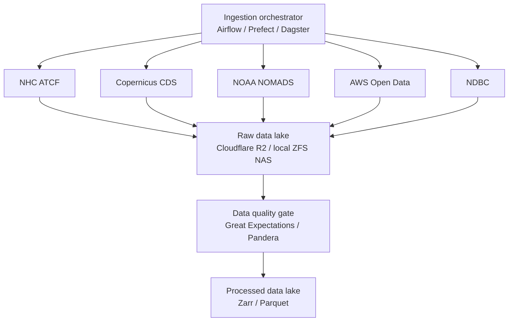

# Data Pipeline

Scope v2.1 §4.2–4.5.

---

## Ingestion



**Rules**

- **Event-driven.** Best-track updates trigger immediate pipeline runs during active storms.
- **Scheduled.** Reanalysis and imagery on 6-hourly and daily cadences.
- **Backfill-aware.** Historical reanalysis requests batched to respect CDS rate limits (4 concurrent jobs).
- **Checksum validation.** Every file MD5-verified against provider metadata before lake storage.

**Implemented in `data/ingestion.py`:** the fetch -> QC gate -> lake-write pipeline as protocols (`Fetcher`, `QCCheck`, `LakeWriter`), a reference `LocalLakeWriter`, and two structural checks (`ChecksumCheck`, `NonEmptyCheck`). `ingest_cycle_inputs()` consumes `AvailabilityOracle`'s resolved cycle and only fetches sources already reported as published.

> **Not yet implemented.** Concrete `Fetcher`s for NHC ATCF, Copernicus CDS, NOAA NOMADS, AWS Open Data, NDBC, or the NOAA/AFRC dropsonde feed — the orchestrator box and the five provider arrows above are still the target, not the current state. The QC gate's default checks are structural, not the distributional rules GE/Pandera would add. The lake is a local filesystem, not yet Cloudflare R2 / ZFS NAS.

---

## Preprocessing

### Stage 1 — standardisation

- GRIB / NetCDF → chunked, compressed **Zarr** for cloud-optimised access
- All time series resampled to 6-hourly UTC synoptic times (00/06/12/18Z)
- All gridded products unified to a common 0.25° lat-lon grid or native icosahedral mesh
- Units normalised: wind kt → m/s, pressure mb → Pa, distance nmi → km

### Stage 2 — storm-centric extraction

- 20°×20° bounding box centred on each storm at each synoptic time
- Environmental sampling within a 500 km radius: 200–850 mb shear, SST, OHC, mid-level moisture, steering flow
- Sliding 24 h / 48 h / 72 h track history windows for LSTM sequences

`Track.window_ending(ts, length)` returns `None` rather than padding when history is short. A partially-observed storm is a different regime and should be handled explicitly, not silently zero-filled.

### Stage 3 — feature engineering

Implemented in `data/features.py`. Eleven derived scalars per storm-time:

| Feature | Notes |
|---|---|
| `shear_magnitude_kt`, `shear_direction_deg` | 200–850 mb deep-layer shear |
| `steering_u_kt`, `steering_v_kt` | Mass-weighted 850/200 mb deep-layer mean |
| `sst_c`, `ohc_kj_cm2` | Area means over the storm-relative box — see `apply_cold_wake()` below |
| `rh700_pct` | Mid-level moisture, environmental area mean |
| `vorticity850_1e5s` | Centred-difference relative vorticity |
| `potential_intensity_kt` | **Proxy** — see below |
| `ivt_kg_ms` | Integrated vapour transport |
| `rh700_inner_core_pct` | Same field as `rh700_pct`, sampled over a tight inner radius (`INNER_CORE_RADIUS_FRAC = 0.15`) instead of the large environmental box |

> **Two documented approximations.** `deep_layer_shear()` uses a centred box mean rather than the operational 200-800 km annular ring -- swapping it out is a single-function change. `potential_intensity()` is an SST/OHC/shear regression standing in for the full Emanuel (1995)/Bister-Emanuel (1998) algorithm; the real closed form is now implemented separately as `emanuel_potential_intensity()`, but is not wired in as the pipeline default -- see [References §3](References) for why (it needs a real boundary-layer sounding `GriddedFields` doesn't carry yet).

**Ocean feedback.** `apply_cold_wake(fields, max_wind_kt, translation_speed_kt)` depresses `sst`/`ohc` by an empirical amount — cooling grows with the cube of wind speed and falls off with translation speed, clamped to a 6 °C ceiling — before `compute_environment_features()` runs. It's a per-cycle adjustment to the input fields, not a new branch in the feature-computation code path, so the "same function computes both flavors" property below still holds. Not an ocean model or two-way coupling; see [Roadmap § Ocean feedback](Roadmap).

Also computed: climatology baselines per storm position and month, and storm-centred anomalies from monthly climatology.

**The critical property:** the *same function* computes both ERA5 and GDAS flavors. If shear were computed one way for pretraining and another for production, Stage B would be correcting for a code difference as well as a data difference, and neither would be diagnosable. Every `FeatureSet` carries its `Flavor` and `assert_flavor()` is called at every boundary where a mismatch would be silent. See [Train/Serve Consistency](Train-Serve-Consistency).

### Stage 4 — dataset construction

| Dataset | Shape |
|---|---|
| LSTM | Tabular sequences (storm_id, time, lat, lon, wind, pressure, + derived) |
| Transformer | Gridded fields (MSLP, Z500, U/V 200/850, T700, RH700) as tokenised patches |
| GNN | Node features, edge features (geodesic distance, pressure gradient), adjacency |
| CNN | Multi-channel imagery stacks (IR, WV, VIS, SST, rain rate), 512² or 1024² in production; `data.satellite.generate_satellite_crop()` synthesizes the same 5 channels at any size offline |
| Diffusion | Latent vectors from trained deterministic models + observed outcome distributions |
| PINN | Residual fields enforcing ∇·V ≈ 0, geostrophic balance, mass continuity |

---

## Splits

Scope v2.1 §4.4. Implemented in `data/splits.py`.

| Split | Seasons | Purpose |
|---|---|---|
| Training | 1980–2019 | Parameter learning |
| Validation | 2020–2022 | Hyperparameter tuning, early stopping, **promotion decisions** |
| Test | 2023–2025 | Unbiased evaluation vs NHC consensus. **Metered** |
| Operational | 2026+ | Live inference, never training |

These are `data.splits.DEFAULT_BOUNDARIES` — **Stage A (ERA5 pretrain) only.** Stage B (GDAS fine-tune) uses its own, separate `STAGE_B_BOUNDARIES`, scoped to GDAS's real archive window rather than reused from Stage A's decades-deep one:

| Split | Seasons | Why |
|---|---|---|
| Training | 2021–2022 | The only seasons with both real GDAS coverage and final best-track labels in the current HURDAT2 archive (21/16 storms respectively) |
| Validation | 2023 | Same real-data constraint |
| Test | 2024–2025 | Intentionally seasons the archive doesn't have data for yet — fills in as `--sync-archive` accumulates newer seasons |
| Operational | 2026+ | Same as Stage A's — that range's meaning (live, not-yet-reanalysed storms) isn't stage-specific |

Reusing `DEFAULT_BOUNDARIES` for Stage B was a real bug: its `train` range (1980–2019) has zero overlap with real GDAS data at all, so `--split train` always returned 0 real samples — masked by requests that 404'd anyway until `gdas-cache`'s season-range fix (#22) made the 0 explicit. Every real Stage B model-registry tag (`storm_split: train-2021-2022_val-2023-2023`) reflects this table, not the one above it — that's expected, not a discrepancy.

Two properties are enforced mechanically because both were ambiguous in v2:

1. **Storm-wise disjointness.** No storm contributes fixes to more than one split. Splitting on individual synoptic times would let a model see a storm's 24 h fix in training and its 36 h fix in test — leakage of nearly the entire signal. A storm straddling a year boundary is assigned by the season of its *first* fix so it lands wholly in one split.

2. **Temporal ordering.** Split boundaries are also chronological, so the test set is strictly in the future of the training set.

> v2's text described the split as "storm-wise, not time-wise" while defining it by year ranges. It is in fact **both**, and both properties are worth keeping — so `assert_no_leakage()` asserts both rather than leaving it to be argued about.

```python
from anemoi.data.splits import assign_splits, assert_no_leakage
assignment = assign_splits(tracks)
assert_no_leakage(assignment, tracks)   # raises LeakageError
```

---

## Versioning

- **DVC** tracks every preprocessing run, feature-engineering script version and raw data snapshot
- Each training run references a DVC commit hash
- MLflow experiments link to DVC versions via the `dvc_version` tag — see [Experiment Tracking](Experiment-Tracking)

---

## Synthetic stand-in

`data/synthetic.py` generates archives with the same shape and statistics as the real feeds, so the whole pipeline is testable offline. Storms follow a plausible recurving climatology with realistic intensity behaviour. It is a stand-in for the ingestion layer, not a simulation of the atmosphere.

Generated tracks are `FINAL` quality, matching HURDAT2's nature as post-season reanalysis.

The generator applies a deliberate **GDAS-vs-ERA5 offset** (`GDAS_BIAS`: wind +1.5 kt, RH −2%, SST −0.15 °C, noise ×1.6). Without it the skew audit would always report zero and the fine-tuning stage would look pointless. The specific values are not a claim about the real offset between those analysis systems.

---

## Real gridded fields: ERA5 and GDAS/GFS

`anemoi.data.real_gridded` reads real analysis fields for both flavors — a different source format for each, because that's what's actually publicly available per source, not a design choice:

```python
from anemoi.data.real_gridded import open_era5, era5_to_gridded_fields
ds = open_era5(valid_time)                                   # Zarr, anonymous GCS
fields = era5_to_gridded_fields(ds, center_lat, center_lon)   # -> GriddedFields

from anemoi.data.real_gridded import fetch_gdas_grib2_fields, gdas_to_gridded_fields
messages = fetch_gdas_grib2_fields(valid_time)                          # byte-range GRIB2
fields = gdas_to_gridded_fields(messages, center_lat, center_lon, valid_time)
```

**ERA5** reads Google's ARCO-ERA5 Zarr store directly — anonymous, no CDS account, no rate limit, no GRIB parsing. **GDAS/GFS** has no equivalent public pressure-level Zarr (checked before building this: dynamical.org's GFS Icechunk/Zarr stores exist but are surface/near-surface only — no 200/500/700/850 mb fields), so it byte-range fetches only the ~7 needed GRIB2 messages from NOAA's AWS Open Data mirror using the `.idx` sidecar, rather than the full ~450 MB file. See [Data Sources](Data-Sources) for the source-by-source reasoning.

Neither source has OHC; GDAS's atmospheric GRIB2 file additionally has no SST. Both are named placeholder constants (`OHC_PLACEHOLDER_KJ_CM2`, `GDAS_SST_PLACEHOLDER_C`), documented in the function docstrings, not silent approximations.

**Optional extra:** `uv sync --extra gridded` (xarray, zarr, gcsfs, eccodes, requests). ERA5 needs no system package; GDAS's `eccodes` PyPI package is bindings only and needs the real `libeccodes` library separately (`sudo apt-get install libeccodes0` on Debian/Ubuntu — see `docs/train_infrastructure.md`, this corrects an earlier wrong "no system install needed" claim here). **Not yet wired as the default source** for the CLI/API/demo, matching HURDAT2/ATCF/satellite's scope below — `data/synthetic.py` remains the default. Network-touching tests are opt-in (`ANEMOI_RUN_NETWORK_TESTS=1`), so the default suite stays offline.

---

## Real storm archive: HURDAT2

`anemoi.data.hurdat2.parse_hurdat2(text)` parses the public NHC HURDAT2 format into `TrackQuality.FINAL` `Track` objects — the same contract `data/synthetic.py` produces, so it is a drop-in replacement for the archive-generation role, not a new pipeline stage:

```python
from anemoi.data.hurdat2 import parse_hurdat2_file
tracks = parse_hurdat2_file("hurdat2-atl-1851-2024.txt")
```

Only synoptic-hour (00/06/12/18Z) entries with both wind and pressure reported become a `Fix`. HURDAT2 also carries off-synoptic entries (landfall, peak intensity, "special" records) and, for older or otherwise incomplete records, a `-999` missing-pressure sentinel — neither is representable by the `Fix` contract, so those rows are dropped rather than guessed at. A storm left with zero representable fixes after filtering is skipped entirely.

**Not yet wired as the default archive source.** The CLI, the demo API state, and the test suite all still call `data/synthetic.py`; pointing them at a real downloaded HURDAT2 file instead of the generator is a follow-up, not part of this parser. This is also only the *final*-quality half of the real-data story — `recalibrate_from_pairs()` (§ below, and [Train/Serve Consistency](Train-Serve-Consistency)) needs real *working*-quality fixes paired against these to actually recalibrate the noise emulator; a real a-/b-deck/TC-Vitals parser is tracked separately.

---

## Synthetic satellite crops

Satellite was entirely unimplemented — no ingestion, no synthetic stand-in, nothing feeding the CNN channel stack even offline. `anemoi.data.satellite.generate_satellite_crop()` fills the stand-in role `data/synthetic.py` plays for `GriddedFields`: a storm-relative, 5-channel `(IR, WV, VIS, SST, rain rate)` image at any size, with a directionally honest intensity relationship — colder IR/WV brightness temperature and heavier rain rate toward the center for a more intense storm, matching deeper, better-organized eyewall convection. Not a simulation of real convection.

```python
from anemoi.data.satellite import generate_satellite_crop, crop_to_cnn_input
crop = generate_satellite_crop("AL092026", valid_time, max_wind_kt=110.0, size=64)
batch = crop_to_cnn_input(crop)          # (1, 5, 64, 64) numpy array
```

No torch dependency in this module — `crop_to_cnn_input()` returns plain numpy; a caller with the torch extra installed wraps it with `torch.from_numpy()`. The `goes` source was already registered in `data/sources.py` (operational role, not opportunistic — geostationary coverage, unlike microwave/dropsonde) with its availability/scheduling fully modeled; this closes the data-generation gap, not the scheduling one. Real GOES ingestion (actual ABI imagery, real storm-relative cropping) remains future work alongside GRIB2 ingestion — see [Roadmap](Roadmap) §1.

---

Related: [Data Sources](Data-Sources) · [Train/Serve Consistency](Train-Serve-Consistency) · [Storage and Versioning](Storage-and-Versioning)
