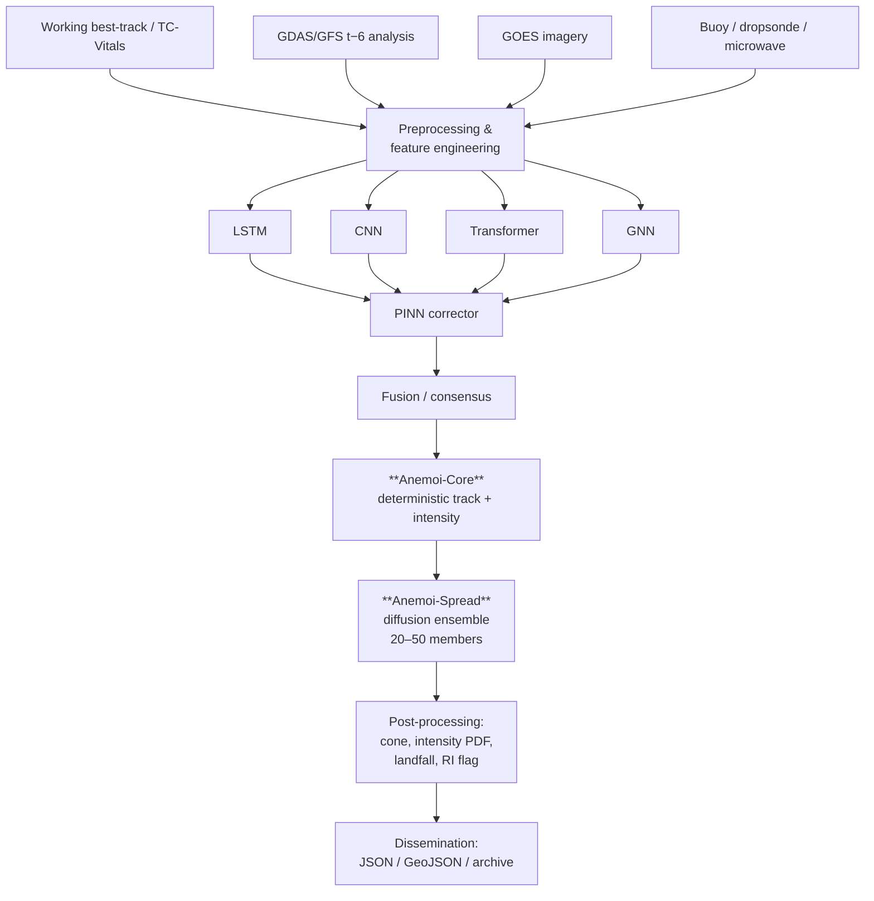

# Anemoi

**Anemoi** — *many winds, one forecast* — is a hurricane forecast platform at [anemoi.systems](https://anemoi.systems).

Six model architectures each read the storm differently. **Anemoi-Core** fuses five of them into a deterministic track and intensity forecast; **Anemoi-Spread** generates the ensemble behind the cone, intensity PDF, landfall probability and rapid-intensification flag. Each architecture carries the name of a Greek wind god — see [Branding and Naming](Branding).

This wiki documents **Scope v2.1** and the reference implementation built against it.

> **Status:** the operational logic is complete and tested. The models are real PyTorch modules with correct shapes and latent contracts, but they are untrained and connected to synthetic data. Nothing here has forecast skill yet. See [Roadmap](Roadmap).

---

## Start here

| If you want to… | Go to |
|---|---|
| Install and run something | [Getting Started](Getting-Started) |
| Understand the system shape | [System Architecture](System-Architecture) |
| Know why v2.1 exists | [Train/Serve Consistency](Train-Serve-Consistency) |
| Understand cycle timing | [Inference Cycle](Inference-Cycle) |
| Find a module | [Codebase Map](Codebase-Map) |
| Know what to call something | [Branding and Naming](Branding) |
| See what changed from v2 | [Decision Log](Decision-Log) |
| Call Anemoi-API | [API](API) |

---

## The six invariants

v2.1's corrections all live at boundaries — which data may be read when, which artifact may be promoted, what happens when a feed is late. Each rule is a function that raises, called at the point where violating it would otherwise be a one-line change.

| Invariant | Enforced by | Raises |
|---|---|---|
| Reanalysis and final best-track are never read during a cycle | `sources.assert_not_operational` | `OperationalUseError` |
| Final best-track is never a model input | `besttrack.assert_input_safe` | `ValueError` |
| Features from one flavor never reach the other path | `features.assert_flavor` | `FlavorMismatchError` |
| Every model ends on the operational flavor before promotion | `curriculum.assert_deployable` | `CurriculumError` |
| Cycle `t` uses the `t−6` NWP cycle, never `t` | `time_utils.select_nwp_cycle` | `NWPUnavailableError` |
| A Group 1 retrain invalidates diffusion and fusion | `registry.pin_set`, `triggers.expand_jobs` | `RegistryError` |

Six independent checks for what is arguably one policy is deliberate. Each guards a different entry point, and any one being bypassed still leaves the others.

---

## System at a glance

---

## Two findings from building it

Both are places where the arithmetic did not agree with the scope text. Details in [Decision Log](Decision-Log).

1. **The `t+1:30` vitals timeout is about ten minutes too generous.** With the reduced-ensemble profile's 70-minute worst case and a 30-minute advisory margin, a cycle starting at `t+1:30` finishes at `t+2:40` — a 20-minute margin, not 30. The timeout is now derived rather than written down, yielding `t+1:20`.

2. **A cone drawn from ensemble spread needs a real-time guard.** Calibration cannot be measured at forecast time, because there is no observation yet. `spread_skill` is a post-hoc verification tool only; `build_cone` uses an ensemble-radius-vs-climatology proxy instead.

---

## Page index

**Concepts**
[System Architecture](System-Architecture) · [Model Catalog](Model-Catalog) · [Glossary](Glossary)

**Data**
[Data Sources](Data-Sources) · [Data Pipeline](Data-Pipeline) · [Train/Serve Consistency](Train-Serve-Consistency)

**Training**
[Training Architecture](Training-Architecture) · [Retraining Triggers](Retraining-Triggers) · [Model Registry](Model-Registry) · [Experiment Tracking](Experiment-Tracking)

**Production**
[Inference Cycle](Inference-Cycle) · [Degraded Modes](Degraded-Modes) · [Operations Runbook](Operations-Runbook) · [Monitoring](Monitoring) · [Verification Metrics](Verification-Metrics) · [Storage and Versioning](Storage-and-Versioning)

**Development**
[Getting Started](Getting-Started) · [Codebase Map](Codebase-Map) · [Configuration Reference](Configuration-Reference) · [Testing](Testing) · [API](API)

**Project**
[References](References) · [Decision Log](Decision-Log) · [Roadmap](Roadmap)
