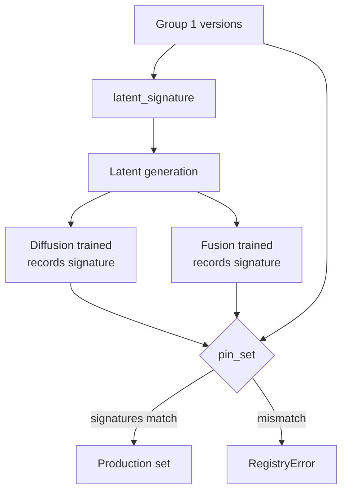

# Model Registry

Scope v2.1 §7.1, §5.7, §10.2. Implemented in `tracking/registry.py`.

MLflow is the intended backend. When it is absent or unreachable the registry degrades to a **local JSON store** and syncs later — the §10.1 "MLflow server down" mitigation made real rather than aspirational.

---

## Experiment organisation

One experiment per wind god ([Branding and Naming](Branding)).

```
mlflow/
├── experiments/
│   ├── boreas/          runs/ · hyperparameter_sweeps/ · ablation_studies/
│   ├── notus/
│   ├── eurus/
│   ├── zephyrus/
│   ├── kaikias/
│   ├── skiron/
│   └── fusion/
├── models/
│   └── <name>/  version-N (staging | production | archived)
└── datasets/
    ├── raw/          DVC-tracked
    ├── processed/    feature-engineered
    └── splits/       train/val/test manifests
```

---

## Registration

```python
from anemoi.tracking.registry import ModelRegistry
from anemoi.data.sources import Flavor

reg = ModelRegistry("/path/to/store")
v = reg.register("lstm", run_id="abc123",
                 input_flavor=Flavor.GDAS_FINETUNE,
                 metrics={"track_error_48h_nm": 70.0})
```

Two refusals at registration time:

**ERA5-flavor weights are refused outright.** Per §4.6.1 only Stage B output is a candidate for anything, so a pretrain artifact has no business in the registry at all.

**Derived models must carry a `latent_signature`.** `diffusion` and `fusion` cannot be registered without recording which Group 1 set they were trained against.

---

## Model-set pinning

This is the mechanism that makes "retrain the affected model only" impossible to do accidentally.

`latent_signature()` builds a deterministic signature from the Group 1 version set:

```
lstmv3-cnnv2-transformerv5-gnnv2-pinnv1
```

`pin_set()` then requires:

1. every model in the system is present — all five Group 1 plus diffusion and fusion
2. all members are operational-flavor
3. every derived model's recorded signature **matches** the signature computed from the pinned Group 1 set

```python
reg.pin_set("2026-preseason", {
    "lstm": 3, "cnn": 2, "transformer": 5, "gnn": 2, "pinn": 1,
    "diffusion": 4, "fusion": 4,
})
```

Bump one Group 1 version and the signature changes, so the pin is refused:

> `diffusion v4 was trained against latent signature 'lstmv3-cnnv2-...', but the pinned Group 1 set is 'lstmv4-cnnv2-...'. Regenerate latents and retrain the derived models (§5.7).`

Latents must be regenerated and the derived models retrained before the set can be pinned. The invariant cannot be violated by forgetting.



The trigger layer enforces the same rule going the other way — see [Retraining Triggers](Retraining-Triggers).

---

## Lifecycle

Staging → Production → Archived.

```python
reg.transition("lstm", version=4, stage=Stage.PRODUCTION)
```

Promoting a new production version automatically archives the incumbent.

---

## Rollback

§10.2. Returns production to the most recent archived version.

```python
previous = reg.rollback("lstm")
```

Registry state persists to JSON, so **rollback survives a process restart** — which matters, because the moment you need it is unlikely to be a calm one.

Other rollback paths from §10.2:

| Kind | Procedure |
|---|---|
| **Model** | Revert MLflow registry to the previous production version |
| **Data** | DVC checkout the previous known-good dataset version and retrain from that checkpoint |
| **Pipeline** | Container images tagged by git commit; roll back the image |
| **Execution mode** | If parallel training fails repeatedly on resource contention, orchestrator falls back to sequential with an alert |

---

## MLflow degradation

The MLflow client is duck-typed, so tests can pass a stub and an outage degrades cleanly:

```python
def _mirror(self, method, *args):
    if self._mlflow is None:
        return
    try:
        getattr(self._mlflow, method)(*args)
    except Exception:
        self._mlflow = None   # local store continues
```

Tracking must never fail a training run. `test_mlflow_failure_degrades_to_local_only` covers this.

---

## Real MLflow server and client (optional, alongside local JSON)

A real MLflow server now exists to point at: `docker/mlflow/` (Docker
Compose, Postgres backend store, R2-backed artifact store reusing
`tracking.checkpoint_store`'s same bucket/credentials under a
`mlflow-artifacts/` prefix). `tracking.mlflow_client
.mlflow_client_from_env()` builds a real `mlflow.tracking.MlflowClient`
from `MLFLOW_TRACKING_URI` and is wired into `cli.cmd_train`/
`cmd_train_schedule`'s `ModelRegistry` construction -- set the env var and
a real training run mirrors to MLflow automatically, alongside the local
JSON store it always writes regardless. Unset (or mlflow not installed),
it returns `None`, which `ModelRegistry` already treats identically to
"MLflow unreachable" above.

If the server sits behind a Cloudflare Tunnel gated by Cloudflare Access
(the intended real deployment, not exposing it directly), MLflow's REST
client has no built-in way to attach the required service-token headers --
`tracking.cloudflare_access.CloudflareAccessRequestHeaderProvider` fills
that gap as a real MLflow plugin (`mlflow.request_header_provider` entry
point in `pyproject.toml`), discovered and applied automatically to every
outgoing request once `CF_ACCESS_CLIENT_ID`/`CF_ACCESS_CLIENT_SECRET` are
set -- a no-op otherwise, so it's harmless against a server not behind
Access.

**The gap above is now fixed.** The `_mirror` calls were rewritten against
the real `MlflowClient` API's actual signatures (confirmed via
`inspect.signature` on the installed client, not assumed):
`create_registered_model` is now called first (get-or-create, since
`create_model_version` requires the registered model to already exist),
`create_model_version`'s second argument is now a real `source` artifact
URI (`register()`'s new `checkpoint_uri` parameter) rather than the local
integer version number, and `transition_model_version_stage` now sends
MLflow's real TitleCase stage strings (`"Staging"`) instead of this
project's own lowercase `Stage` enum values (`"staging"`). `register()`
also takes an optional `mlflow_run_id` (from `tracking.experiment_tracking
.log_curriculum_stages()`) to link a registered version back to the real
run that produced it. See [Experiment Tracking](Experiment-Tracking) for
the run-creation/tagging side of this, and `docker/mlflow/README.md` for
where this was originally caught.

---

Related: [Experiment Tracking](Experiment-Tracking) · [Retraining Triggers](Retraining-Triggers) · [Training Architecture](Training-Architecture)
