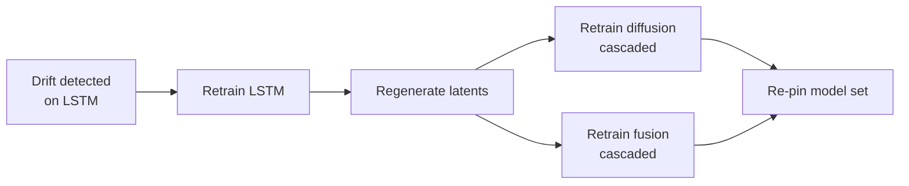

# Retraining Triggers

Scope v2.1 §5.5, with the §5.7 dependency correction. Implemented in `training/triggers.py`.

---

## Trigger table

| Trigger | Condition | Action | Mode |
|---|---|---|---|
| **Scheduled** | 1st of every month | Full retraining on expanded dataset | Parallel |
| **Seasonal** | May 1 (Atlantic season prep) | Retrain all models on latest history | Parallel |
| **Drift** | Validation loss up >15% over 3 consecutive checks | Retrain the affected model **+ cascade** | Sequential (isolated) |
| **Skew** | Rolling 14-day skew delta over threshold (§4.6.3) | **Stage B re-fine-tune only** + cascade | Sequential |
| **Data volume** | >500 new synoptic times since last training | Incremental retraining, warm-start | Parallel |
| **Manual** | Researcher initiates | Optuna sweep via MLflow | Sequential or Parallel |
| **Nightly** | 02:00 UTC, **no active storms** | Diffusion-only refresh on new latents | Sequential |
| **Latent desync** | A derived model's recorded `latent_signature` != the current Group 1 champion set (§5.7, #149) | Retrain the desynced derived model | Parallel (group 2/3) |

```python
from anemoi.training.triggers import evaluate_all, SeasonState
jobs = evaluate_all(now, SeasonState(active_storms=("AL092026",)),
                    drifted_models=("lstm",), new_synoptic_times=600)
```

`evaluate_all` runs every trigger and returns a de-duplicated, dependency-ordered job list.

---

## Running it unattended: `anemoi retrain-check`

`evaluate_all` was real and well-tested from the start, but nothing outside tests ever called it — confirmed by grep, zero real callers before this command existed. `anemoi retrain-check` closes that gap: it gathers real signals and dispatches real training.

```bash
anemoi retrain-check --hurdat2 <real archive> --api-url https://anemoi-api-real.<account>.workers.dev
```

Real signals gathered, each degrading honestly rather than crashing on failure:

- **`now`** — real wall-clock UTC (or `--now <iso>` to evaluate a specific date, e.g. for backtesting).
- **`new_synoptic_times`** — a real count of HURDAT2 fixes newer than the most recently *registered* Group 1 version (any stage) — "how much real data has accumulated since we last tried training at all."
- **Active storms and per-model drift** — a real query against `--api-url`'s `/v1/storms` and `/v1/monitoring/drift/{model}`; an unreachable API degrades to an empty/no-drift signal with a printed warning, not a crash (this must be safe to run every day, unattended).

**Only `scheduled_monthly`/`preseason`/`data_volume` are dispatched.** All three produce the identical job shape (every Group 1 model plus the derived cascade), which is exactly `train-schedule`'s own default schedule — dispatch is just invoking that same machinery. `nightly_latent` and isolated drift/skew/latent-desync retrains are *reported*, not dispatched — see [Roadmap §7](Roadmap#7-autonomous-retraining-orchestration--calendardata-volumedriftskewlatent-desync-detected-only-calendardata-volume-auto-dispatch) for the real scope decision behind that (not a blocker: drift, skew, and latent-desync detection are all real now, #148/#149 — dispatch for a single-model shape is separate, genuinely future work).

`--dry-run` evaluates and prints without ever dispatching training — the safe way to check what would happen. Exit code 0 means "evaluated successfully" (whether or not anything fired); a real training failure inside the dispatched schedule still returns 1, same as `train-schedule`.

---

## The cascade

v2's drift trigger said: **"retrain the affected model only."** Applied to any Group 1 model, that is wrong.

Anemoi-Spread's diffusion model and the fusion layer train on latents extracted from specific Group 1 checkpoints. Retrain an LSTM in isolation and you get a new LSTM producing latents in a different representation space, feeding a diffusion model trained to interpret the old one. **Nothing errors.** The ensemble simply becomes worse, in a way that is very hard to attribute.

`expand_jobs()` applies the invalidation automatically:

```python
from anemoi.training.triggers import on_drift
on_drift("lstm")
# [RetrainJob(model='lstm',      reason=DRIFT,   cascaded=False),
#  RetrainJob(model='diffusion', reason=CASCADE, cascaded=True),
#  RetrainJob(model='fusion',    reason=CASCADE, cascaded=True)]
```

Guarantees:

- Group 1 jobs always ordered before derived jobs
- duplicate derived jobs collapsed — an explicitly-requested diffusion retrain is not doubled by the cascade
- retraining a *derived* model cascades no further



The registry enforces the same rule from the other direction — see [Model Registry](Model-Registry).

---

## Champion/latent desync detection (§5.7, GitHub #149)

The cascade above fires when a retrain is *happening right now* — but the same invalidation can happen with no retrain in the picture at all. `ModelRegistry.champion(name)` (`production()` else `staging()`, what a real cycle actually uses) is looked up independently per model, and never goes through `pin_set`'s consistency gate. Confirmed live three times in one day (2026-09-22): `registry-reconcile` re-staging `lstm`/`cnn`/`gnn`/`pinn` to better-metric *already-registered* versions desynced the then-current `fusion` each time, with nothing noticing.

`training.real_inference_cycle._real_fusion_forecast`'s own consistency check (§5.7, above) already refuses to *serve* a desynced combination — that part was already correct, degrading to the non-learned consensus rather than silently combining mismatched representations. What was missing was noticing the desync *happened* at all:

```python
from anemoi.tracking.registry import ModelRegistry
registry = ModelRegistry(root)
registry.desynced_derived_models()   # () when coherent, e.g. ("fusion",) when not
```

`api.real_state.RealState.pending_retrain_jobs()` calls this on every request now (a pure, cheap read of already-loaded registry state — no network, no recomputation) and feeds it into `evaluate_all(desynced_models=...)`, which shapes it into a real `RetrainJob(reason=Reason.LATENT_DESYNC)` via `on_latent_desync`. Unlike the cascade above, this does **not** route through `expand_jobs`'s Group-1-invalidation logic — the desynced model already *is* the derived model, and retraining a derived model invalidates nothing further.

**Detected and surfaced, not auto-fixed.** Consistent with how drift/skew already work in this codebase (see the note below), `LATENT_DESYNC` is reported via `GET /v1/retraining/triggers`, not auto-dispatched by `anemoi retrain-check` — actually re-running a full training job unattended, specifically off this trigger, is separate future work. This was a real, considered decision among three options `registry.py`'s Decision Log entry for #149 has the writeup for (the other two being decoupling fusion's training set from live champions entirely, and accepting degradation as the permanent steady state) — detection was the load-bearing gap, and it's closed.

---

## Skew triggers Stage B only

When the [skew audit](Monitoring) alerts, only the fine-tune stage reruns. The pretrained representation is still valid; what has moved is the operational distribution. The job carries `note="Stage B re-fine-tune only (§4.6.3)"` and tag `Trigger.SKEW_DETECTED`.

---

## Nightly latent refresh is suppressed during storms

v2 retrained the diffusion model nightly at 02:00, **unconditionally**.

During an active storm that means consecutive advisories carry forecasts from different models, and any change in ensemble spread between them is uninterpretable — you cannot tell whether uncertainty grew or the generator changed.

```python
nightly_latent(now, SeasonState(active_storms=("AL092026",)))   # []
nightly_latent(now, SeasonState())                               # [diffusion job]
```

While a storm is active the pinned model set holds and the refresh waits.

---

## Drift detection

`monitoring/drift.py` supplies the signal for the drift trigger. Two independent detectors.

### Feature drift

Compares live feature distributions against a **`ReferenceDistribution`** — which must be the Stage B distribution:

```python
ReferenceDistribution.fit(samples, Flavor.ERA5_PRETRAIN)
# DriftError: drift reference must be the Stage B (gdas_finetune) distribution
```

Comparing live GDAS features to ERA5 statistics would show a large constant offset that is not drift at all. It would either fire permanently or be tuned until it never fires.

| Signal | Default threshold | What it usually means |
|---|---|---|
| Standardised mean shift | > 2.0 σ | Model pushed off its training manifold |
| Variance ratio | > 3× or < ⅓ | Upstream feed returning a constant, or a units change |

Minimum 30 live samples before assessing.

### Validation loss

`ValidationLossMonitor` implements the §5.5 rule directly: loss above `baseline × 1.15` for **3 consecutive checks**. A single recovery resets the count.

---

Related: [Training Architecture](Training-Architecture) · [Model Registry](Model-Registry) · [Monitoring](Monitoring)
