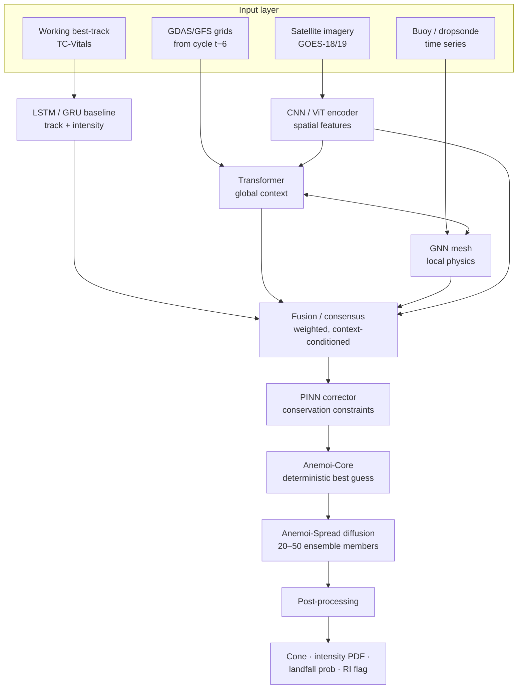

# System Architecture

Scope v2.1 §2.

Anemoi-Core produces a single deterministic track and intensity forecast by fusing six model families. Anemoi-Spread conditions a diffusion model on Anemoi-Core latents to generate a structurally diverse ensemble, from which the public products are derived.

The differentiator is not any one architecture. It is **model diversity plus physics regularisation plus generative ensembles** — six architectures each optimised for a distinct prediction modality, a PINN layer preventing physically implausible output, and a diffusion generator producing genuinely different scenarios rather than perturbed initial conditions.

---

## Forecast path

---

## Layers

| Layer | Responsibility | Modules |
|---|---|---|
| **Ingestion** | Fetch, checksum, land in the raw lake | `data/sources`, `data/availability` |
| **Preprocessing** | Regrid, storm-relative extraction, derived features | `data/features` |
| **Deterministic models** | Group 1: LSTM, CNN, Transformer, GNN, PINN | `models/*` |
| **Fusion** | Weighted consensus into the Anemoi-Core best guess | `models/fusion`, `inference/cycle` |
| **Ensemble** | Anemoi-Spread diffusion over Anemoi-Core latents | `models/diffusion` |
| **Post-processing** | Cone, PDFs, landfall, RI | `inference/postprocess` |
| **Orchestration** | Cycle timing, gating, degraded modes | `inference/scheduler`, `inference/cycle` |
| **Training** | Curriculum, waves, triggers, promotion | `training/*` |
| **Tracking** | Tags, registry, model-set pinning | `tracking/*` |
| **Monitoring** | Skew audit, feature and loss drift | `monitoring/*` |
| **Verification** | Deterministic and probabilistic scoring | `metrics/*` |

---

## Design stance

The scope describes an ML system, but the parts most likely to produce a wrong forecast are not the models. They are the boundaries: which data may be read when, which artifact is allowed to be promoted, what happens when a feed is late.

v2 had defects in exactly those boundaries — same-cycle GFS that does not exist yet, final best-track used as an input, promotion on the test set, a single-model retrain silently invalidating the ensemble generator. So the implementation puts its effort there. Every boundary rule from v2.1 is a function that raises. The models are honest implementations, but they are the replaceable part.

---

## Two structural dependencies worth internalising

**Cycle `t` consumes the `t−6` NWP cycle.** GFS 0.25° publishes ~3.5–4 hours after its cycle time. The cycle named `t` does not exist at `t`. See [Inference Cycle](Inference-Cycle).

**Anemoi-Spread and fusion train on Group 1 latents.** Retraining any Group 1 model in isolation leaves them conditioned on a representation space that no longer exists. See [Model Registry](Model-Registry).

---

Related: [Model Catalog](Model-Catalog) · [Data Pipeline](Data-Pipeline) · [Inference Cycle](Inference-Cycle)
