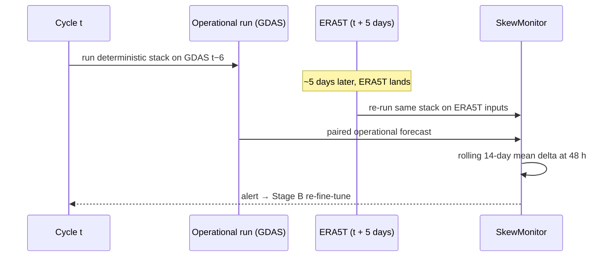

# Train/Serve Consistency

Scope v2.1 §4.6. The most consequential change from v2, and the reason several modules exist in the shape they do.

> **Principle.** A model is trained, validated and *promoted* on the same input distribution it will see in production. Reanalysis is a pretraining luxury, not an operational dependency.

---

## The problem

v2 trained on ERA5 reanalysis and final HURDAT2 best-track, then served on GFS analyses and real-time ATCF fixes. Those are different distributions, and the difference is not small.

**ERA5 vs GDAS.** Different assimilation systems, different model cores, different bias characteristics. ERA5 also has ~5 days of latency, so it can never be an operational input — the "fall back to GFS" described in v2 was not a fallback, it was the permanent operating condition.

**Final vs working best-track.** HURDAT2 is reanalysed after the season using aircraft, scatterometer and satellite data that did not exist in real time, then smoothed. A model trained on it learns to rely on precision that is unobtainable at inference.

A model fitted on the first distribution and served the second is being asked to extrapolate at exactly the moment it matters.

---

## The policy

Three rules, each mechanised.

> **This is convergent practice, not a local invention.** GenCast (Price et al., *Nature* 2025) was trained on ERA5 and subsequently fine-tuned on operationally available HRES-fc0 analyses for deployment as WeatherNext; the public repository ships **both** the ERA5 and the operational weight sets. Same two-stage structure, arrived at independently by a team shipping an operational system. See [References](References).

### 1. ERA5 pretrains; GDAS serves

| Stage | Data | Period | Purpose |
|---|---|---|---|
| **A — Pretrain** | ERA5; final best-track as labels | 1980–present | Representation learning on the long, clean record |
| **B — Fine-tune** | GDAS/GFS 0.25° analyses; working best-track / TC-Vitals as **inputs**; final best-track as labels | 2015–present | Adapt to the noisier, biased operational distribution |

Stage B's learning rate defaults to an order of magnitude below Stage A's (1e-4 vs 1e-3). The aim is to re-seat the model on the operational distribution, not to relearn the representation on a decade of data.

**Stage B is never optional.** A run that stops after Stage A produces a model that is excellent on data it will never see. `assert_deployable()` is what stops it reaching the registry.

```python
from anemoi.training.curriculum import Curriculum, assert_deployable
cur = Curriculum.standard("lstm")          # A then B
assert_deployable(run)                      # raises CurriculumError if incomplete
```

`Curriculum.__post_init__` additionally refuses any curriculum whose final stage is not the operational flavor:

> `lstm: the final stage must be the operational (gdas_finetune) flavor — a curriculum ending on ERA5 produces a model that has never seen its serving distribution`

### 2. Final best-track is a label, never an input

Model inputs come from working-quality fixes. For historical training where no working track was archived, the emulator degrades the final track by measured error.

### 3. One code path per derived feature

Shear is computed by the same function in both flavors, so any measured gap is attributable to data rather than code. See [Data Pipeline](Data-Pipeline).

---

## Where each rule lives

| Rule | Function | Raises |
|---|---|---|
| No reanalysis in the cycle | `sources.assert_not_operational` | `OperationalUseError` |
| No final track as input | `besttrack.assert_input_safe` | `ValueError` |
| No flavor mixing | `features.assert_flavor` | `FlavorMismatchError` |
| Curriculum ends operational | `curriculum.assert_deployable` | `CurriculumError` |
| No pretrain weights registered | `registry.register` | `RegistryError` |
| No pretrain metrics gate promotion | `promotion.evaluate_promotion` | `PromotionError` |

Six independent checks for one policy is deliberate. Each guards a different entry point, and any single one being bypassed still leaves the others.

---

## The noise emulator

§4.6.2. `besttrack.emulate_working_fix()` degrades a `FINAL` fix into an `EMULATED` one by applying:

- an isotropic 2-D position displacement with the measured RMS — **Rayleigh magnitude**, so the per-axis sigma is `rms / √2`. Not independent lat/lon jitter, which would understate error near the poles and impose a preferred axis
- Gaussian intensity and pressure error
- quantisation to 0.1 degree and 5 kt, matching operational reporting

| Constant | Default | Status |
|---|---|---|
| `position_rms_nm` | 15.0 | Documented placeholder |
| `intensity_rms_kt` | 5.0 | Placeholder — **likely optimistic** |
| `pressure_rms_mb` | 3.0 | Placeholder — **likely optimistic** |

> Torn & Snyder (2012) put satellite-only intensity uncertainty near 10 kt for tropical storms and 12 kt for category 1–2, with pressure uncertainty from 7 to 12 mb by intensity. The scope's 5 kt and 3 mb are roughly half that and less. They also find the error is **intensity-dependent** — position uncertainty falls with intensity while intensity uncertainty rises — which the current scalar-RMS emulator does not represent. See [References](References).

`recalibrate_from_pairs()` measures the real values from archived working/final pairs and **should replace these before Stage B is taken seriously**:

```python
from anemoi.data.besttrack import recalibrate_from_pairs
noise = recalibrate_from_pairs([(working_fix, final_fix), ...])
```

`anemoi.data.atcf` now supplies the real pairs: `parse_bdeck()` for the working side, `data.hurdat2.parse_hurdat2()` for the final side, and `pair_by_valid_time(working_track, final_track)` to match them by `storm_id` + `valid_time` before handing the result to `recalibrate_from_pairs()`. `test_atcf.py::test_recalibration_from_real_parsed_pairs_measures_nonzero_error` demonstrates the full chain. Not yet wired as the default source for Stage B recalibration — that's pointing it at a real archive file, tracked the same way as [Roadmap](Roadmap) §1's storm-archive row.

> Quantisation means a small perturbation sometimes leaves a position unchanged. That is faithful to the real product, not a bug — `test_quantisation_can_leave_a_position_unchanged` pins the behaviour so nobody "fixes" it later.

---

## The skew audit

§4.6.3. A policy that cannot detect its own failure is an assertion. `monitoring/skew.py` implements the check.



**Alert thresholds:** rolling 14-day mean 48 h track delta above **15 nm**, or mean intensity delta above **4 kt**.

**Response:** a Stage B re-fine-tune of the affected model. Stage B only — the pretrained representation is still valid; what has moved is the operational distribution.

The monitor returns `None` below **8 samples** rather than a noisy estimate. With a handful of storms a fortnight, a two-sample mean would fire the retrain trigger on one unusual case.

Metrics logged: `skew_track_delta_nm_48h`, `skew_intensity_delta_kt_48h`.

---

## Fallback semantics

§4.6.4. The role split changes what an outage means.

| Scenario | Impact | Mitigation |
|---|---|---|
| Copernicus CDS outage | Stage A data delayed; **zero operational impact** — ERA5 is not an operational input | Queue ERA5 backfill; pause skew-audit jobs until restored |
| NOMADS outage (GDAS/GFS) | Operational gridded input missing | Fall back to cached `t−12`; if > 12 h stale, degrade to LSTM + climatology with an explicit staleness flag |

See [Degraded Modes](Degraded-Modes).

---

Related: [References](References) · [Data Sources](Data-Sources) · [Training Architecture](Training-Architecture) · [Monitoring](Monitoring) · [Decision Log](Decision-Log)
