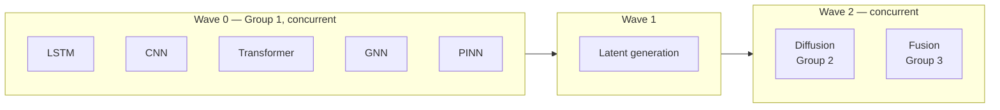

# Training Architecture

Scope v2.1 §5.1–5.4, §5.7. Implemented in `training/orchestrator.py`.

The orchestrator is deliberately backend-agnostic: it computes the schedule and calls a `runner` callable. That keeps the dependency graph testable without Kubernetes, Slurm or a GPU.

---

## Execution modes

### Sequential

**Use case:** single-GPU environments, debugging, ablation studies, initial development.

Order: **LSTM → CNN → Transformer → GNN → PINN → latents → Diffusion → Fusion**

Cheap models first, so failures surface early. Lower peak GPU memory, easier debugging, deterministic failure isolation. Full cycle takes roughly 6–10× parallel mode.

> v2's stated sequential order **omitted the fusion model entirely**. It is included here, and `test_sequential_schedule_includes_fusion` guards against the omission returning.

**Local (non-cloud) runs.** `training.device.get_device()` picks MPS on Apple Silicon, then CUDA, then CPU — no cloud provisioning needed for this mode's actual use case. The transformer builder defaults to ~4.8M parameters; #9's capacity ablation and #12's noise-sensitivity comparison are both small/short enough to run this way rather than on rented GPU compute. See [Storage and Versioning](Storage-and-Versioning) for what *does* need real GPU-hours (#22's full Stage A/B run).

**Cloud (#22) runs.** One on-demand L4 GPU VM (`anemoi-train-1`, GCP project `anemoi-training`, `us-central1` — co-located with ARCO-ERA5, which is what actually drives the data-fetch phase's wall clock, not the GPU) runs all five Group 1 models concurrently — this single GPU, not the 5+-worker cluster this page describes above, is what "parallel mode" actually needs at the model sizes #9 measured. Moved off Spot provisioning after real preemptions cost mid-stage training progress (`train_*_stage` only checkpoints at the end of a completed stage, not per-epoch) — see docs/train_infrastructure.md's "Training VM" and "GPU capacity" sections, including a real zone-migration runbook for when a zone's L4 capacity stockouts out, and a recorded vast.ai fallback option. Full setup: [docs/train_infrastructure.md](https://github.com/jasonkolodziej/anemoi/blob/main/docs/train_infrastructure.md) in the main repo.

An image-first Cloud Run Job packaging path also exists at `docker/cloud-run-training/` (`entrypoint.sh`, `cloudbuild.yaml`, and setup guide) -- the image itself is the `training` target of `docker/multistage.Dockerfile`, shared with the Cloudflare Containers API image (whose `api` target builds with `torch-cpu` instead of `torch`; one uv-based install, diverging only in extras/entrypoint/OCI metadata). It runs `anemoi train-schedule` directly without `slurm/*.sbatch` wrappers. Keep the platform constraint in mind: GPU-backed Cloud Run Job tasks currently cap each task attempt at 1 hour, so long runs need CPU jobs or split/restart-safe scheduling.

**Real training runner status.** LSTM has one (`training.real_run.run_lstm_curriculum`, `anemoi train --model lstm`) — real Stage A → Stage B against a real HURDAT2 file, real multi-lead verification (`DEFAULT_LEADS`, 12–120h, masked where a storm's track doesn't reach a lead), durable R2 checkpoint upload every stage, registry + promotion-gate evaluation at the end. It's first because it's architecturally track-only (`models.lstm.build_lstm` never reads gridded pixels), so it needs no ERA5/GDAS cache to run for real — only tracks. Both stages have run for real on the training VM: Stage A → Stage B val loss improved 1.27 → 1.05, checkpoints genuinely landed in R2, registered as `lstm v1` (promotion correctly fails production thresholds — an untuned first pass, not a competitiveness claim).

CNN has one too (`training.real_run_cnn.run_cnn_curriculum`, `anemoi train --model cnn`) — real GOES imagery isn't fetched yet, but `build_cnn`'s architecture just consumes any multi-channel 2-D image (resolution-agnostic, global average pool), so it reads the real cached `GriddedFields` (all 10 fields) as its channel stack instead. Reads from local `era5_cache`/`gdas_cache` dirs; a fix with no cached file yet is skipped, not an error, so it trains on however much is cached and improves as the ingest jobs fill in more.

Transformer has one too (`training.real_run_transformer.run_transformer_curriculum`, `anemoi train --model transformer`) — same real cached-field channel stack as CNN, but the patch-embedding architecture isn't resolution-agnostic, so the real 41×41 cached crop is trimmed to the model's fixed 40×40 grid size (divisible by patch size). The synoptic-regime head is computed but not supervised — no real regime labels exist yet.

GNN has one too (`training.real_run_gnn.run_gnn_curriculum`, `anemoi train --model gnn`) — no real station/buoy network exists to supply the "irregular mesh" `build_gnn`'s docstring frames as the intended input, so this treats the same real cached grid as a lattice mesh instead: cells subsampled every 4 in each direction become nodes (10 field values + row/col offset from centre — 12 features, matching `build_gnn`'s own `node_features=12` default exactly), 4-connectivity gives the edges (3 features, matching `edge_features=3` exactly). Samples batch the standard block-diagonal way (concatenate node blocks, offset each sample's edge indices) rather than one graph at a time — `build_gnn`'s own `index_add_`-based implementation (not PyG) supports this without any change.

PINN has one too (`training.real_run_pinn.run_pinn_curriculum`, `anemoi train --model pinn`) — the last of the five, and architecturally different from the other four: `build_pinn`'s own docstring frames it as a residual corrector *applied on top of a candidate forecast*, not a predictor from raw input. This runner trains a small internal LSTM each run as that candidate (self-contained, not dependent on a specific external checkpoint existing), plus a real environment vector (`data.features.compute_environment_features`) from the same cached `GriddedFields`. `physics_residuals` is folded into the loss, but only over the 12/24/36/48h leads — the uniformly 12h-spaced prefix of `DEFAULT_LEADS` its constant-`dt_hours` assumption is actually valid for (48-120h gaps are 24h, not 12h — passing one dt_hours across the full 7-lead sequence would silently misreport speed by up to 4x on those legs).

**All seven tasks the schedule can contain now have real implementations, and `training.orchestrator` is wired to run all of them as one schedule.** `training.real_orchestrator.RealOrchestratorRunner` (`anemoi train-schedule`) implements `orchestrator.run_schedule`'s injected `runner` callable for real: it dispatches each `Task` to the matching function, registers the result in `ModelRegistry`, and evaluates promotion — the same sequence `anemoi train` already does for one model, generalised across the whole wave schedule. `orchestrator.py` itself needed no changes; it was already built backend-agnostic specifically for this.

The `latents` task (`training.real_latents.extract_joint_latents`) runs each of the five just-trained Group 1 models' `.encode()` over the same real HURDAT2 windows — the hook `models.base.ModelSpec`'s docstring says was built for exactly this — building a real joint conditioning vector, each model's own real Stage B forecast (converted to a shared absolute lat/lon/wind space using that model's exact `real_run.RunArtifacts` standardisation stats, not a refit approximation), and a real synoptic context vector from the window's own track data. It runs against the trained model objects still in memory from the same schedule run, since `ModelVersion` doesn't record a checkpoint_uri and PINN's candidate LSTM is never persisted at all.

Diffusion (`training.real_run_diffusion`) trains the standard DDPM epsilon-prediction objective over `models.diffusion.build_diffusion`'s own cosine schedule against the real masked multi-lead targets; validation reduces the trained ensemble to its per-sample mean for `metrics.track.verify`. Fusion (`training.real_run_fusion`) trains `models.fusion.build_fusion`'s learned consensus weights with a masked MSE directly in the shared absolute-coordinate space (no further standardisation needed there). Both register with the real `latent_signature` computed from the Group 1 versions they were trained against (§5.7 model-set pinning) — a Group 1 retrain correctly invalidates them. `run_schedule`'s own §10.1 dependency semantics (one task's failure only skips *its* dependents) still apply: if a Group 1 model's real training fails, `latents` is skipped, and `diffusion`/`fusion` are skipped in turn.

**Real run on the training VM, 2026-09-17:** with both splits fetched, LSTM (v2) and CNN (v1) both completed for real, registered, and tagged in real MLflow runs (`boreas`/`notus` experiments). Transformer then hit a real CUDA OOM: every `train_*_stage` trains full-batch (the whole cached dataset as one GPU tensor), so per-step VRAM scales with how much real data is cached, not with batch size — a bigger GPU buys headroom, not a fix, since the real ERA5/GDAS cache keeps growing. `--n-augment 1` was the real working stopgap while the durable fix was built.

**Streaming training (durable fix, #22).** All five models now have a real, tested, opt-in streaming training path — `training.streaming` (`OnlineMeanStd`/`OnlineMaskedLeadMeanStd`, Chan's parallel-batch generalisation of Welford's algorithm, verified numerically equivalent to each model's existing single-pass `_standardize_x`/`_standardize_y`; `WindowDataset`, a real `torch.utils.data.Dataset` that loads one window's real cached data on demand instead of materializing the whole array) plus `train_lstm_stage_streaming`, `train_cnn_stage_streaming`/`train_transformer_stage_streaming`, `train_gnn_stage_streaming`, and `train_pinn_stage_streaming`/`_train_candidate_lstm_streaming`. Every `run_*_curriculum` takes `streaming: bool = False, batch_size: int` — default unchanged (the full-batch path is still there, still what CI and small runs use); `streaming=True` gives real per-batch training via a `torch.utils.data.DataLoader`, `O(batch_size)` VRAM instead of `O(dataset size)`, no need to cut `n_augment` to stay under a GPU's memory ceiling. GNN's shared lattice `MeshTopology` and `batch_graph`'s block-diagonal batching needed no changes — built once, lazily, on the first window loaded, then reused per `DataLoader` batch. PINN needed its own small `_PinnWindowDataset` (environment vector + raw track window + base lat/lon, three things `WindowDataset`'s single-array contract can't carry together) and streams its candidate-generator LSTM too, not just the outer corrector. Full design, what's still deferred (`real_latents.py`'s own materialize-then-batch pattern, mid-stage checkpointing), and a keepdims broadcasting bug found and fixed along the way: `docs/streaming_dataloader.md` in the main repo.

**Real streaming relaunch, 2026-09-17.** With `--streaming` wired into both `anemoi train`/`anemoi train-schedule` (#64) and `run_local.sh`'s env passthrough fixed to actually forward it to the launched tmux session (#66 — the same silent-failure class already documented for `SYNC_ARCHIVE`; caught before it wasted GPU time re-running full-batch), a real sequential schedule run against the VM's real (partially-populated, still-growing) ERA5/GDAS cache got LSTM, CNN, Transformer, and GNN all the way through — real Stage A→B training, real checkpoints, real MLflow registration, zero OOMs (Transformer and GNN even reached `staging=True`). Real per-model wall-clock: LSTM ~12 min (track-only, no cache I/O), CNN ~94 min, Transformer ~158 min, GNN in progress at time of writing — CNN/Transformer/GNN's much higher cost than LSTM traces to a real, not-yet-optimized inefficiency: every streaming `DataLoader` (`real_run*.py`) defaults to `num_workers=0`, and the per-window cached-field read (`load_cached_fields`) has no memoization, so every epoch re-reads and re-decompresses the same `.npz` files from scratch, serially, in the main process (confirmed via `/proc/<pid>/io`: high `rchar`/`syscr` throughput served entirely from the OS page cache, zero incremental `read_bytes` — CPU/decompression-bound, not disk-I/O-bound). `docs/streaming_dataloader.md` §3 originally scoped `num_workers` parallelism as a "free" win that was never actually wired in — a real, concrete follow-up, not urgent (nothing crashes) but worth doing before the cache grows much further.

PINN then failed with a new, different error — real progress, not a regression: `ValueError: non-finite feature value`. Root cause (PR #67): real ERA5 `sea_surface_temperature` is NaN over land (GDAS's `sst`/`ohc` are constant placeholders, never NaN, so this is Stage A only), and `data.features.area_mean` used a plain `np.mean` — one land pixel in a storm's box poisoned the whole area mean to NaN. PINN is the only model exposed to this (the only one calling `compute_environment_features`; CNN/Transformer/GNN read raw field pixels directly, LSTM never touches gridded fields), and it only surfaced now because every earlier real run died at Transformer's OOM before ever reaching PINN against real cache data. Fixed with `np.nanmean` — a real, deliberate change to what "SST near this storm" means for a partially-land-covered box (the effective sampling footprint shrinks toward whatever ocean remains, invisibly to the returned scalar; `area_mean`'s own docstring has the full physical discussion) — plus a skip, not a crash, for the box-entirely-over-land case (`build_pinn_samples`/`train_pinn_stage_streaming` both drop that window, the same "no cached file yet" contract used elsewhere). `latents`/`diffusion`/`fusion` were skipped that run since PINN (a Group 1 model) failed — `run_schedule`'s dependency semantics working as designed, not a separate bug. Since trained artifacts live only in-memory for one process (`RealOrchestratorRunner.trained_artifacts`, never reloaded from checkpoint storage), getting a real `latents`/`diffusion`/`fusion` run still needs all five models to succeed within one schedule invocation — the fix requires a full relaunch, not a resume.

Two more real findings from re-verifying the PINN fix on the VM. First, a serious infra gap: the VM never had `loginctl linger` enabled, so systemd silently killed the *entire* tmux server — including a separate multi-hour ERA5 cache-fetch job — the moment SSH connections briefly hit zero, no error, no traceback (`journalctl` showed `Removed slice User Slice of UID 1001` at the exact moment everything vanished). Fixed permanently with `sudo loginctl enable-linger`, documented in `docs/train_infrastructure.md` (PR #68) — every earlier real run on this VM was exposed to this the whole time and just got lucky on SSH timing. Second, the `num_workers=0` DataLoader cost flagged above is now fixed (PR #70): `streaming.make_dataloader`, a shared helper every `train_*_stage_streaming` function uses, adds a real `num_workers` parameter (default 0, unchanged) that forces `multiprocessing_context="fork"` explicitly when set — deliberate, not the platform default, since macOS (local dev) defaults to `spawn` since Python 3.8, which would require every model's `build_x`/`collate_fn` closures to be picklable; forcing `fork` lets them work as-is via copy-on-write memory. `--num-workers` is wired into both CLI subcommands and all six sbatch scripts (the five individual `train_<model>.sbatch` scripts had no `--streaming` support at all until this PR — only `train_schedule.sbatch` did).

**A real full-schedule run "succeeded" and wasn't (2026-09-17 → 2026-09-18) — the log's `[OK]`/`staging=` lines are not sufficient evidence of correctness.** With the `num_workers` fix live, a real `train-schedule --streaming --num-workers 4` run completed all 8 tasks with `succeeded: [...]`, `failed: []` — but a direct `MlflowClient` query against the real run IDs (not the log) found `train_loss`/`val_loss`/every downstream metric was `nan` for CNN, Transformer, GNN, and diffusion (which inherits its conditioning latents from those three via `.encode()`); only LSTM and PINN were real. `promotion.evaluate_promotion` calls `assert_deployable` but never checks whether a candidate's own metric is finite — with no incumbent to compare against, it auto-promotes regardless of value, so diffusion/fusion both showed `staging=True` despite being NaN. Root cause: real ERA5 `sea_surface_temperature` is NaN over land (the same fact PR #67 already fixed for PINN's `area_mean` scalar reduction), but CNN/Transformer/GNN read raw field pixels directly into the model with zero NaN handling — a single NaN pixel reached `training.streaming.OnlineMeanStd`'s plain running mean during the online stats-fitting pass and corrupted `x_mean`/`x_std` *permanently* for the whole stage, so every window's standardized input came out NaN, not just the one that touched land. Fixed in PR #73: `data.features.sanitize_field_pixels` (same "sample from remaining ocean" semantics as `area_mean`, applied per-pixel) plus `training.streaming.filter_windows_with_finite_fields` (drops a window only if a channel is *entirely* NaN), applied at all four raw-pixel call sites including `real_latents.py`, which independently duplicated the same unsanitized stacks.

**Relaunching after PR #73 surfaced two more real, previously-hidden bugs — both only visible once training could actually complete cleanly.** First: fusion's registered model version had no MLflow run at all (`run_id` was the empty string) — `branding.experiment_name("fusion")` raised `KeyError` since fusion has no `WindGod` entry by design ("a model but not a god"), silently swallowed by `log_stage_run`'s deliberate catch-all `except Exception: return None`. Fixed in PR #75 by special-casing `"fusion"` in `experiment_name` directly, without inventing a fake compass-direction god for it. Second, and not yet fixed: diffusion's real metrics, once verified via MLflow, are physically nonsensical rather than NaN — `track_error_48h_nm` around 4800 (every other model landed 250-310), `intensity_error_36h_kt` around 1000 (every other model landed 12-17), with `val_loss` roughly 8x `train_loss` (real overfitting signal on a small, 1448-sample real latent dataset). Confirmed not a units/scale bug — `real_run_diffusion.py`'s un-standardization and ensemble-mean reduction are structurally identical to every other model. Root cause is `TrajectoryDenoiser.sample()`'s 200-step DDPM reverse loop having no clipping on intermediate values, so the denoiser drifts far out-of-distribution at inference and that drift gets multiplied by real `y_std` into absurd real-unit errors. This is real ML engineering work (x0-clipping, regularization, or a reduced step count), not a quick patch — tracked as issue #76, blocking #10/#15 the same way an absent diffusion model did before, just for a different reason now.

### Parallel

**Use case:** production retraining, pre-season refreshes, hyperparameter sweeps.



Requires a minimum of 5 GPU workers for Group 1, or Kubernetes GPU scheduling. Full cycle completes in roughly 1.5× the longest single model.

```python
from anemoi.training.orchestrator import Mode, build_schedule, validate_schedule
schedule = build_schedule(Mode.PARALLEL)
validate_schedule(schedule)   # every dependency resolves in an earlier wave
schedule.peak_gpus            # 5
schedule.total_hours_high     # worst-case wall clock
```

---

## Latent generation is an explicit wave

§5.7. Anemoi-Spread's diffusion model and the fusion layer do not train on raw data. They train on **latents extracted from specific Group 1 checkpoints**.

```
Group 1 completion ──┬──► Latent encoder ──► Diffusion training dataset (Zarr)
                     │    (extracts latent vectors from
                     │     LSTM/Transformer/GNN/CNN/PINN
                     │     best checkpoints)
                     │
                     └──► Fusion training dataset
                          (all model predictions +
                           observed outcomes)
```

The stage:

- runs after all Group 1 models finish (parallel) or after PINN completes (sequential)
- loads the best checkpoint from each Group 1 model's MLflow production/staging artifact
- generates latents for the full train/val/test splits
- stores a versioned Zarr dataset in the processed lake
- triggers Group 2 and Group 3

v2 left this implicit. It takes real time and GPU — 1.5–3 hours, 24 GB — and is scheduled as its own wave.

---

## Resource profiles

### Sequential

| Model | GPU memory | Time | Queue |
|---|---|---|---|
| LSTM | 8 GB | 4–6 h | 1 |
| CNN | 16 GB | 8–12 h | 2 |
| Transformer | 40 GB | 18–24 h | 3 |
| GNN | 24 GB | 12–16 h | 4 |
| PINN | 16 GB | 6–10 h | 5 |
| Diffusion | 48 GB | 24–36 h | 6 (after latents) |
| **Total** | — | **~72–104 h** | — |

### Parallel

| Group | Models | GPUs | Memory each | Runtime |
|---|---|---|---|---|
| Group 1 | LSTM, CNN, Transformer, GNN, PINN | 5 | 8–40 GB | 18–24 h (longest = Transformer) |
| Group 2 | Diffusion | 1–2 | 48 GB | 24–36 h |
| Group 3 | Fusion | 1 | 8 GB | 2–4 h |
| **Total** | — | **6–7 GPUs** | — | **~42–60 h** |

`test_parallel_cycle_fits_the_appendix_b_target` asserts the parallel worst case stays within the 72-hour production threshold.

### Scheduling notes

- **Kubernetes:** GPU device plugin plus node affinity — pin Transformer and Diffusion to A100 nodes, LSTM and Fusion to RTX 4090 / A40.
- **Slurm:** Group 1 as a job array (`sbatch --array=0-4`), Group 2 with `--dependency=afterok:<group1_jobid>`.
- **Docker Compose:** `deploy.resources.reservations.devices` per service, `depends_on` for Group 2 sequencing.

> HPA scales pods, not nodes. If the cluster is fixed-size, autoscaling a training job accomplishes nothing — cluster autoscaling or a queue is what actually adds capacity.

---

## Per-model pipeline stages

§5.3. Identical in both execution modes.

| Stage | Action |
|---|---|
| 1. Environment provisioning | Docker image pulled (CUDA 12.x, PyTorch); GPU allocated via Kubernetes / Slurm / Compose |
| 2. Data loading | DVC-versioned dataset materialised; splits verified for leakage |
| 3. Model initialisation | Architecture built from config; warm-start from prior checkpoint where applicable |
| 4. Training loop | **Stage A then Stage B** per [Train/Serve Consistency](Train-Serve-Consistency); per-epoch metrics to MLflow |
| 5. Evaluation | Validation metrics on **operational-flavor** inputs |
| 6. Registration | Promotion gates — see below |

---

## Failure isolation

A Group 1 failure does not stop its siblings (§10.1: "one model fails, others continue"), but it **does** skip everything downstream. Latent generation against an incomplete checkpoint set would produce a diffusion model trained on a set that will never be pinned.

```python
result = run_schedule(schedule, runner)
result.succeeded   # ['lstm', 'transformer', ...]
result.failed      # ['gnn']
result.skipped     # ['latents', 'diffusion', 'fusion']
```

`latent_signature` is recorded only on a clean run — `test_latent_signature_is_recorded_only_on_a_clean_run`.

---

## Promotion gates

§5.3 Stage 6, revised. Implemented in `training/promotion.py`. Two changes from v2, both about not lying to ourselves.

### Promotion is decided on validation, never on test

v2 promoted on **test** metrics. Selecting repeatedly against a held-out set converts it into a validation set, and the "unbiased evaluation vs NHC consensus" it was reserved for stops being unbiased.

```python
evaluate_promotion("lstm", run, val_metrics)
# PromotionError if val_metrics.split != "val"
```

The test set is touched on an explicit budget:

```python
budget = TestSetBudget(max_evaluations_per_season=4)
budget.spend("lstm", "pre-season verification vs 2025 storms")
# PromotionError when exhausted, or when justification is blank
```

Every look spends a little of the test set's power to say anything unbiased. Metering and logging them is what makes the reservation worth anything.

### Metrics must come from the operational flavor

A candidate evaluated on ERA5 inputs is not evidence about production behaviour.

### Gates

| Gate | Requirement |
|---|---|
| **Staging** | Candidate beats the incumbent on `track_error_48h_nm` |
| **Production** | Staging, **plus** every threshold passes, **plus** a manual gate |

The manual gate is on by default (`require_manual_gate=True`). An automated pipeline that can put a model in front of an emergency manager without anyone looking at it is a hazard, not a feature.

Thresholds are in [Verification Metrics](Verification-Metrics).

---

## Hyperparameter optimisation

§5.6.

- **Framework:** Optuna integrated with MLflow
- **Pruning:** median pruning on validation loss after 10 epochs
- **Sequential:** one Optuna study, one trial at a time
- **Parallel:** distributed Optuna with Redis/JournalStorage; each trial an independent MLflow run
- **Best trial:** automatically registered as the candidate for that architecture

---

Related: [Retraining Triggers](Retraining-Triggers) · [Model Registry](Model-Registry) · [Experiment Tracking](Experiment-Tracking)
